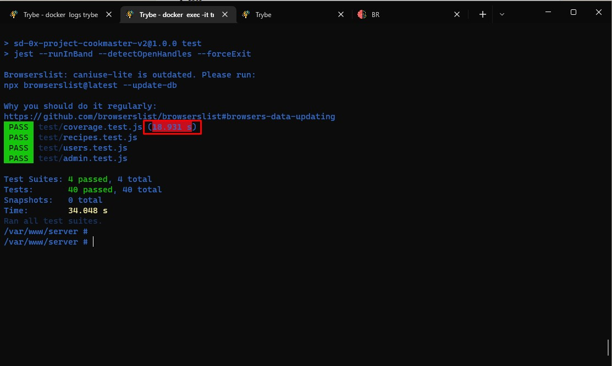
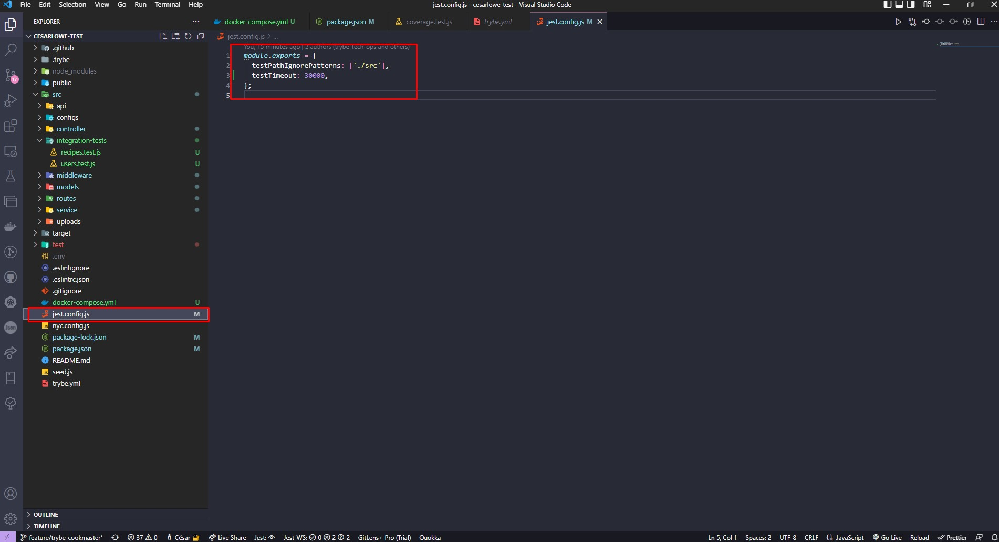

### Estrutura
Foi usada a estrutura dentro da pasta **src**:
Além de pastas já existentes no projeto foram criadas as pastas:
*configs*:
-url de configuração da api.
-configurações do multer para criação de path e imagens;
*controller e services*
- foi criada controllers e services para organização das regras de negócio;
*models*
- foi criada uma pasta de models para conexão com o banco mongo e criar as açõesz;
*routes*
- foi feita a separação de cada arquivo de rotas com seus respectivos serviços para organização;
*middleware*
- middleware de autenticação do usuário;
*api*
- foi criado um arquivo (routes.js) para chamar todas as rotas.

### Packages
**YUP** --[Yup](https://www.npmjs.com/package/yup);
usado para validações;

**express-handler-errors** ----[Express handle errors](https://www.npmjs.com/package/express-handler-errors);
usado para criar erros personalizados;

# Testes
- Ao rodar os testes de coverage no windows tive problemas com alguns comandos linux, por isso criei um container com imagem de banco de dados  e backend em linux, com isso tive êxito. ;

- Houve um problema com timeout no teste coverage, por default o jest tem 5000 milissegundos para rodar um teste, caso não ocorra dentro do tempo gera um erro, portanto alterei o timeout para 50000 e consegui executar normalmente. Acredito que esse tempo maior para executar o teste é por conta da imagem no docker, porém gostaria de deixar um registrado para caso ocorrer esse problema, provavelmente na máquina que vocês rodam o teste isso não ocorra. ;

### Feedback sobre o projeto

# Dificuldades
- Testes -> Não estou tão habituado a fazer testes, então essa foi a parte que tive mais dificuldades, sei que preciso melhorar nesse quesito.
- Eslint -> Nota para algumas configurações de funções que também precisei organizar o código de uma forma diferente, como por exemplo a quantidade de linhas para uma mesma função, para corrigir criei funções separadas que inclusive foram reutilizadas.

# Considerações finais
- Agradeço muito a oportunidade de poder fazer um teste para uma empresa como a trybe, muito conceituada e reconhecida como uma das melhores escolas do Brasil. Espero corresponder as expectativas, estou em constante evolução, sempre procurando adquirir mais conhecimento. As vezes o que precisamos é uma oportunidade para mostrar o quanto somos dedicados.

